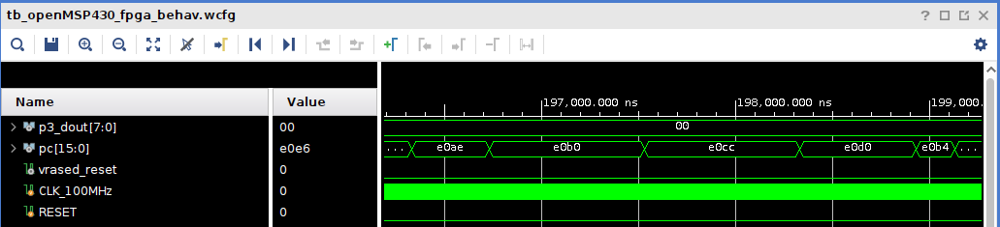
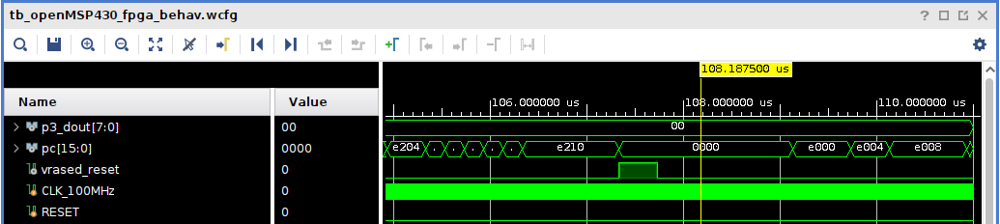

# UCCA:

Special-purpose micro-controller units (MCUs) have become ubiquitous. They appear in a wide variety of sensing/actuation applications, from smart personal spaces to complex industrial control systems and safety-critical medical equipment. While many of these devices perform safety-critical tasks, they often lack support for security features compatible with their importance to overall system functions. This lack of architectural support leaves them vulnerable to run-time attacks that can remotely alter their intended behavior, with potentially catastrophic consequences. In particular, we note that (despite existing mechanisms, such as memory protection units -- MPUs) MCU software often includes untrusted third-party libraries (some of them closed-source) that are blindly used within MCU code, without proper isolation from the rest of the system. In turn, a single vulnerability (or intentional backdoor) in one such third-party software can often compromise the entire MCU.

In this paper, we tackle this problem by designing, demonstrating security, and formally verifying the implementation of UCCA: an <ins>U</ins>ntrusted <ins>C</ins>ode <ins>C</ins>ompartment <ins>A</ins>rchitecture. UCCA provides flexible hardware-enforced isolation of untrusted code sections (e.g., third-party software modules) in resource-constrained embedded devices. UCCA is transparent to (and can be used jointly with) existing hardware and software on the device. To demonstrate UCCA practicality, we implement an open-source version of the design on a real resource-constrained MCU: the well-known TI MSP430. Our evaluation shows that UCCA incurs little overhead and is affordable even to lowest-end MCUs, incurring significantly less overhead and required assumptions than prior related work.

### UCCA Directory Structure

	├── msp_bin
	├── openmsp430
	│   ├── contraints_fpga
	│   ├── fpga
	│   ├── msp_core
	│   ├── msp_memory
	│   ├── msp_periph
	│   └── simulation
	├── scripts
	│   ├── build
	│   ├── build-verif
	│   └── verif-tools
	├── simple_app
	│   └── simulation
	├── utils
	├── verification_specs
	│   └── soundness_and_security_proofs
	├── violations_controlled_invocation
	│   ├── malicious_jump_between
	│   │   └── simulation
	│   ├── malicious_jump_into_last
	│   │   └── simulation
	│   ├── malicious_jump_into_mid
	│   │   └── simulation
	│   ├── malicious_jump_out_fst
	│   │   └── simulation
	│   ├── malicious_jump_out_mid
	│   │   └── simulation
	│   └── malicious_jump_within
	│       └── simulation
	├── violations_cr_integrity
	│   ├── cr_write_fst
	│   │   └── simulation
	│   ├── cr_write_last
	│   │   └── simulation
	│   └── cr_write_mid
	│       └── simulation
	├── violations_region_validity
	│   ├── invalid_region_eq
	│   │   └── simulation
	│   └── invalid_region_lt
	│       └── simulation
	├── violations_return_integrity
	│   ├── malicious_return_complex
	│   │   └── simulation
	│   └── malicious_return_simple
	│       └── simulation
	├── violations_stack_protection
	│   ├── malicious_stack_write_complex
	│   │   └── simulation
	│   ├── malicious_stack_write_simple
	│   │   └── simulation
	│   └── write_to_pointer
	│       └── simulation
	└── vrased
		├── hw-mod
		└── hw-mod-nusmv

## Dependencies Installation

Environment (processor and OS) used for development and verification:
Intel Xeon W-2145
Ubuntu 20.04.1 

Dependencies on Ubuntu:

		sudo apt-get install bison pkg-config gawk clang flex gcc-msp430 iverilog tcl-dev
		cd scripts
		sudo make install

## Building UCCA Software 
To generate the Microcontroller program memory configuration containing UCC definitions (CR) and sample applications we are going to use the Makefile inside the scripts directory:

        cd scripts

This repository accompanies 6 categories of test-cases: simple_app, violations_controlled_invocation, violations_cr_integrity, violations_region_validity, violations_return_integrity, and violations_stack_protection. (See [Description of Provided test-cases] for details on each test-case)
These test-cases correspond to one benign execution and scenarios where the device is reset due to a violation that could be used to attack the correctness of the execution.
To build UCCA for a specific test-case run:

        make "name of test-case"

For instance:

        make simple_app

to build the software including the binaries of simple_app test-case.
Note that this step will not run any simulation, but simply generate the MSP430 binaries corresponding to the test-case of choice.
As a result of the build, two files pmem.mem and cr.mem should be created inside msp_bin directory:

- pmem.mem program memory contents corresponding the application binaries

- cr.mem contains UCC definitions.

In the next steps, during synthesis, these files will be loaded to the MSP430 memory when we run UCCA simulation using VIVADO simulation tools.

If you want to clean the built files run:

        make clean

        Note: Latest Build tested using msp430-gcc (GCC) 4.6.3 2012-03-01

To test UCCA with a different application you will need to repeat these steps to generate the new "pmem.mem" file and re-run synthesis.

## Creating an UCCA project on Vivado and Running Synthesis

This is an example of how to synthesize and prototype UCCA using Basys3 FPGA and XILINX Vivado v2022.1 (64-bit) IDE for Linux

- Vivado IDE is available to download at: https://www.xilinx.com/support/download.html

- Basys3 Reference/Documentation is available at: https://reference.digilentinc.com/basys3/refmanual

#### Creating a Vivado Project for UCCA

1 - Clone this repository;

2 - Follow the steps in [Building UCCA Software](#building-UCCA-software) to generate .mem files for the application of your choice.

2- Start Vivado. On the upper left select: File -> New Project

3- Follow the wizard, select a project name and location. In project type, select RTL Project and click Next.

4- In the "Add Sources" window, select Add Files and add all *.v and *.mem files contained in the following directories of this reposiroty:

        openmsp430/fpga
        openmsp430/msp_core
        openmsp430/msp_memory
        openmsp430/msp_periph
        /vrased/hw-mod
        /msp_bin

and select Next.

Note that /msp_bin contains the pmem.mem and cr.mem binaries, generated in step [Building UCCA Software].

5- In the "Add Constraints" window, select add files and add the file

        openmsp430/contraints_fpga/Basys-3-Master.xdc

and select Next.

        Note: this file needs to be modified accordingly if you are running UCCA in a different FPGA.

6- In the "Default Part" window select "Boards", search for Basys3, select it, and click Next.

        Note: if you don't see Basys3 as an option you may need to download Basys3 to your Vivado installation.

7- Select "Finish". This will conclude the creation of a Vivado Project for UCCA.

Now we need to configure the project for systhesis.

8- In the PROJECT MANAGER "Sources" window, search for openMSP430_fpga (openMSP430_fpga.v) file, right click it and select "Set as Top".
This will make openMSP430_fpga.v the top module in the project hierarchy. Now its name should appear in bold letters.

9- In the same "Sources" window, search for openMSP430_defines.v file, right click it and select Set File Type and, from the dropdown menu select "Verilog Header".

Now we are ready to synthesize openmsp430 with UCCA hardware the following step might take several minutes.

10- On the left menu of the PROJECT MANAGER click "Run Synthesis", select execution parameters (e.g, number of CPUs used for synthesis) according to your PC's capabilities.

11- If synthesis succeeds, you will be prompted with the next step to "Run Implementation". You *do not* need to "Run Implementation" to simulate UCCA.

To simulate UCCA using VIVADO sim-tools, continue following the instructions on [Running UCCA on Vivado Simulation Tools].

## Running UCCA on Vivado Simulation Tools

After completing the steps 1-10 in [Creating a Vivado Project for UCCA]:

1- In Vivado, click "Add Sources" (Alt-A), then select "Add or create simulation sources", click "Add Files", and select everything inside openmsp430/simulation.

2- Now, navigate "Sources" window in Vivado. Search for "tb_openMSP430_fpga", and *In "Simulation Sources" tab*, right-click "tb_openMSP430_fpga.v" and set its file type as top module.

3- Go back to Vivado window and in the "Flow Navigator" tab (on the left-most part of Vivado's window), click "Run Simulation", then "Run Behavioral Simulation".

4- On the newly opened simulation window, select a time span for your simulation to run (see times for each default test-case below) and the press "Shift+F2" to run.

5- In the green wave window you will see values for several signals. The imporant ones are "vrased_reset", and "pc[15:0]". pc cointains the program counter value. vrased_reset corresponds to the value of UCCA's reset signal, as described in the paper.

In Vivado simulation, all test-cases provided by default loop infinitely. For all test-cases except simple_app the device should reset in the middle of execution.

To determine the address of an instruction, e.g, the start and end addresses of UCC (values of UCC_min and UCC_max, per UCCA's paper) one can check the compilation file at scripts/tmp-build/XX/vrased.lst  (where XX is the name of the test-case, i.e., if you ran "make simple_app", XX=simple_app). In this file search for the name of the function of interest, e.g., "regionOne" or "secureFunction", etc.

#### NOTE: To simulate a different test-case you need to re-run "make test-case_name" to generate the corresponding pmem.mem file and re-run the synthesis step (step 10 in [Creating a Vivado Project for UCCA]) on Vivado. 

## Description of Provided test-cases

	For details on how UCCA isolates regions in memory (UCCs) and mitigate attack escalation please check the UCCA paper. 

All test-cases use two UCCs. The first UCC isolates a vulnerable buffer copy that is meant to simulate user input. The second UCC isolates the password comparison functionality. The password comparison function is not vulnerable does not need to be isolated, however, this isolation allows for testing UCCA with multiple UCCs. All test-cases were configured to run as is. If edited, the region definitions at the top of the respective test's main.c may need to be adjusted.

#### 1- simple_app:

Corresponds to a toy authentication program, i.e., (1) execute "getUserInput" to simulate a user entering their credentials, (2) determine whether the user successfully authenticated (compare the input against "choas"), (3) perform some secure function (incrementing a counter in this example) if the authentication was successful, and (4) repeat.

Simple_app's simulation runs indefinitely and the device is never reset (i.e. vrased_reset is always 0). In the default configuration the user successfully authenticates and "secureFunction" is called. As such execution will jump into the secure code i.e. pc = E0CC. This jump occurs around 198 microseconds into the simulation.

Simple_app can be modified to simulate a failed authentication attempt. To do this simply open main.c in the simple_app directory and edit the "input" buffer on line 125. 

#### 2- violations_controlled_invocation:

###### 2.1- malicious_jump_into_mid

Corresponds to a test-case where execution jumps to the middle of a UCC from outside of UCC. Controlled Invocation is violated, vrased_reset is set to 1, and the device is reset (pc = 0).

This should occur around 93 microseconds into the simulation.

###### 2.2- malicious_jump_into_last

Corresponds to a test-case where execution jumps to the end of a UCC (UCC_max) from outside of UCC. Controlled Invocation is violated, vrased_reset is set to 1, and the device is reset (pc = 0).

This should occur around 93 microseconds into the simulation.

###### 2.3- malicious_jump_out_fst

Corresponds to a test-case where execution jumps out of a UCC from the first instruction of the UCC (UCC_min). Controlled Invocation is violated, vrased_reset is set to 1, and the device is reset (pc = 0).

This should occur around 95 microseconds into the simulation.

###### 2.4- malicious_jump_out_mid

Corresponds to a test-case where execution jumps out of a UCC from the middle of the UCC. Controlled Invocation is violated, vrased_reset is set to 1, and the device is reset (pc = 0). This test-case exploits the vulnerable buffer within the "getUserInput" function to overwrite the function's return address and alter the control flow of the program.

This should occur around 246 microseconds into the simulation.

###### 2.5- malicious_jump_between_uccs

Corresponds to a test-case where execution jumps out of the middle of one UCC and into the middle of another UCC. Controlled Invocation is violated, vrased_reset is set to 1, and the device is reset (pc = 0). This test-case exploits the vulnerable buffer within the "getUserInput" function to overwrite the function's return address and alter the control flow of the program.

This should occur around 246 microseconds into the simulation.

###### 2.6- malicious_jump_within

Corresponds to a test-case where execution jumps from the middle of a UCC to another address within UCC. Controlled Invocation is not violated and execution continues. Specifically this test causes the "getUserInput" function to return to the start of itself (pc = E266 -> pc = E23E). The cause the function to keep re-executing and trapping execution within UCC. This demosntrates how UCCA simply prevents escalation of attacks but anything within UCC is still vulnerable.

This should occur around 246 microseconds into the simulation.

#### 3- violation_cr_integrity:

###### 3.1- cr_write_fst

Corresponds to a test-case where the program attempts to write to the first address in CR. CR Integrity is violated, vrased_reset is set to 1 and the device is reset (pc = 0).

This should occur around 47 microseconds into the simulation.

###### 3.2- cr_write_last

Corresponds to a test-case where the program attempts to write to the last address in CR. CR Integrity is violated, vrased_reset is set to 1 and the device is reset (pc = 0).

This should occur around 47 microseconds into the simulation.

###### 3.3- cr_write_mid

Corresponds to a test-case where the program attempts to write to the middle of CR. CR Integrity is violated, vrased_reset is set to 1 and the device is reset (pc = 0).

This should occur around 47 microseconds into the simulation.

#### 4- violation_region_validity:

###### 4.1- invalid_region_lt

Corresponds to a test-case where UCC_max is less than UCC_min (UCC_max < UCC_min) for a UCC . This region is invalid, vrased_reset is set to 1 and the device is reset (pc = 0). 

This should occur around 2 microseconds into the simulation.

###### 4.2- invalid_region_eq

Corresponds to a test-case where UCC_max is equal to UCC_min (UCC_max < UCC_min) for a UCC . This region is invalid, vrased_reset is set to 1 and the device is reset (pc = 0). 

This should occur around 2 microseconds into the simulation.

#### 5- violation_return_integrity:

###### 5.1- malicious_return_complex

Corresponds to a test-case where execution jumps from the middle of a UCC to UCC_max of the same UCC. Exploiting the vulnerable buffer within the "getUserInput" function causes the function to return to UCC_max. As execution hasn't left UCC no violation has occured, however as execution malicously jumped to the final instruction of UCC, the stack hasn't been properly cleaned. Data on the stack is misinterpreted as the return address for UCC causing it to return to the wrong address in memory. This violates return integrity, vrased_reset is set to 1 and the device is reset (pc = 0). 

This should occur around 250 microseconds into the simulation.

###### 5.2- malicious_return_simple

Corresponds to a test-case where execution jumps from UCC_max of a UCC to an address other than the actual return address. This violates return integrity, vrased_reset is set to 1 and the device is reset (pc = 0). This test is simple as the binary is instrumented to "perform the attack" rather than actually exploiting the overflow like in the complex case.

This should occur around 196 microseconds into the simulation.

#### 6- violation_stack_protection:

###### 6.1- malicious_stack_write_complex

Corresponds to a test-case where a UCC attmepts to write to an address on the stack below its own stack frame (D_addr below Base Pointer). Exploiting the vulnerable buffer within the "getUserInput" function causes UCC to attempt to write below its Base Pointer. This violates the stack isolation, vrased_reset is set to 1 and the device is reset (pc = 0).

This should occur around 227 microseconds into the simulation.

###### 6.2- malicious_stack_write_simple

Corresponds to a test-case where a UCC attmepts to write to an address on the stack below its own stack frame (D_addr below Base Pointer). This violates the stack isolation, vrased_reset is set to 1 and the device is reset (pc = 0). This test is simple as the program is instrumented to write directly to the stack rather than exploiting the overflow like in the complex case.

This should occur around 157 microseconds into the simulation.

###### 6.3- write_to_pointer

Corresponds to a test-case where a UCC attmepts to write to an address on the stack below its own stack frame (D_addr below Base Pointer). A stack buffer is intialized outside UCC and a reference to the buffer is passed to UCC. When UCC attempts to write this buffer the stack isolation is violated, vrased_reset is set to 1 and the device is reset (pc = 0). This demonstrates that the stack isolation prevents references to variables on the stack from being used within a UCC. However UCC can still access values in the heap as shown in simple_app and all other test-cases.

This should occur around 108 microseconds into the simulation.

#### 7- Examples of simulation test-cases are provided below.

- Simulation window for a benign execution of simple_app. In normal execution, assuming the default simple_app test-case, the program will call the "secureFunction" (PC = E0CC). This indicates the program ran successfully: 

- Simulation window for a Violation example. Violation occurs at instruction PC=E210 causing vrased_reset to switch to 1 and the device to reset (PC = 0000): 

## Running UCCA Verification

To check HW-Mod against UCCA LTL subproperties using NuSMV run:

        make verify

Note that running make verify proofs may take a few minutes. On our implementation verification of UCCA took <1 second. However this time may vary based on your system.

