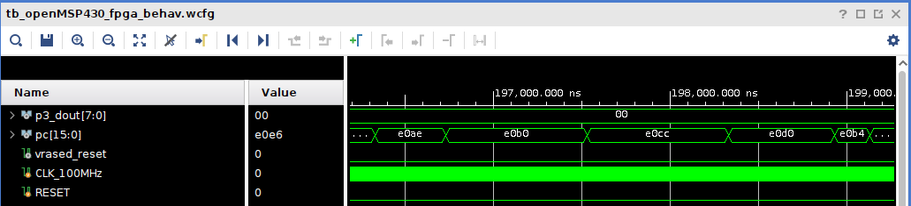

# UCCA:

Micro-controller units (MCUs) implement the de facto interface between the physical and digital worlds. Thus they appear in a variety of sensing/actuation applications, from smart personal spaces to complex industrial control systems and safety-critical medical equipment. While many of these devices perform safety- and time-critical tasks, they often lack support for security features compatible with their importance to overall system functions. This lack of architectural support leaves them vulnerable to run-time attacks that can remotely alter their intended behavior, with potentially catastrophic consequences. In particular, we note that MCU software often includes untrusted third-party libraries (some of them closed-source) that are blindly used within MCU programs, without proper isolation from the rest of the system. In turn, a single vulnerability (or intentional backdoor) in one such third-party software can often compromise the entire MCU software state.

In this paper, we tackle this problem by proposing, demonstrating security, and formally verifying the implementation of UCCA: an <ins>U</ins>ntrusted <ins>C</ins>ode <ins>C</ins>ompartment <ins>A</ins>rchitecture. UCCA provides flexible hardware-enforced isolation of untrusted code sections (e.g., third-party software modules) in resource-constrained and time-critical MCUs. To demonstrate UCCA's practicality, we implement an open-source version of the design on a real resource-constrained MCU: the well-known TI MSP430. Our evaluation shows that UCCA incurs little overhead and is affordable even to lowest-end MCUs, requiring significantly less overhead and assumptions than prior related work.

### UCCA Directory Structure

	├── co-located_isr
	│   └── simulation
	├── img
	├── msp_bin
	├── openmsp430
	│   ├── contraints_fpga
	│   ├── fpga
	│   ├── msp_core
	│   ├── msp_memory
	│   ├── msp_periph
	│   └── simulation
	├── scripts
	│   ├── build
	│   └── verif-tools
	├── simple_app
	│   └── simulation
	├── two_isrs
	│   └── simulation
	├── ucca
	│   ├── hw-mod
	│   └── hw-mod-nusmv
	│       ├── UCCA
	│       ├── cr_integrity
	│       ├── return_integrity
	│       └── stack_integrity
	├── utils
	├── verification_specs
	├── violations_cr_integrity
	│   ├── cr_write_fst
	│   │   └── simulation
	│   ├── cr_write_last
	│   │   └── simulation
	│   └── cr_write_mid
	│       └── simulation
	├── violations_region_validity
	│   ├── invalid_region_eq
	│   │   └── simulation
	│   └── invalid_region_lt
	│       └── simulation
	├── violations_return_integrity
	│   ├── isr_return_invalid
	│   │   └── simulation
	│   ├── malicious_return_complex
	│   │   └── simulation
	│   └── malicious_return_simple
	│       └── simulation
	└── violations_stack_integrity
	    ├── isr_write_invalid
	    │   └── simulation
	    ├── isr_write_valid
	    │   └── simulation
	    ├── malicious_stack_write_complex
	    │   └── simulation
	    ├── malicious_stack_write_simple
	    │   └── simulation
	    └── write_to_pointer
	        └── simulation

## Dependencies Installation

Environment (processor and OS) used for development and verification:
3.70GHz Intel Xeon W-2145 CPU
Ubuntu 20.04.2 

Dependencies on Ubuntu:

		sudo apt-get install bison pkg-config gawk clang flex gcc-msp430 iverilog tcl-dev
		cd scripts
		sudo make install

## Building UCCA Software 
To generate the Microcontroller program memory configuration containing UCC definitions (CR) and sample applications we are going to use the Makefile inside the scripts directory:

        cd scripts

This repository accompanies 6 categories of test-cases: co-located_isr, simple_app, two_isrs, violations_cr_integrity, violations_return_integrity, and violations_stack_integrity. (See [Description of Provided test-cases] for details on each test-case)
These test-cases correspond to three benign executions (co-located_isr, simple_app, two_isrs) and scenarios where the device is reset due to a violation that could be used to attack the correctness of the execution.
To build UCCA for a specific test-case run:

        make "name of test-case"

For instance:

        make simple_app

to build the software including the binaries of simple_app test-case.
Note that this step will not run any simulation, but simply generate the MSP430 binaries corresponding to the test-case of choice.
As a result of the build, two files pmem.mem and cr.mem should be created inside msp_bin directory:

- pmem.mem program memory contents corresponding the application binaries

- cr.mem contains UCC definitions.

In the next steps, during synthesis, these files will be loaded to the MSP430 memory when we run UCCA simulation using VIVADO simulation tools.

If you want to clean the built files run:

        make clean

        Note: Latest Build tested using msp430-gcc (GCC) 4.6.3 2012-03-01

To test UCCA with a different application you will need to repeat these steps to generate the new "pmem.mem" file and re-run synthesis.

## Creating an UCCA project on Vivado and Running Synthesis

This is an example of how to synthesize and prototype UCCA using Basys3 FPGA and XILINX Vivado v2022.1 (64-bit) IDE for Linux

- Vivado IDE is available to download at: https://www.xilinx.com/support/download.html

- Basys3 Reference/Documentation is available at: https://reference.digilentinc.com/basys3/refmanual

#### Creating a Vivado Project for UCCA

1 - Clone this repository;

2 - Follow the steps in [Building UCCA Software](#building-UCCA-software) to generate .mem files for the application of your choice.

2- Start Vivado. On the upper left select: File -> New Project

3- Follow the wizard, select a project name and location. In project type, select RTL Project and click Next.

4- In the "Add Sources" window, select Add Files and add all *.v and *.mem files contained in the following directories of this reposiroty:

        openmsp430/fpga
        openmsp430/msp_core
        openmsp430/msp_memory
        openmsp430/msp_periph
        /ucca/hw-mod
        /msp_bin

and select Next.

Note that /msp_bin contains the pmem.mem and cr.mem binaries, generated in step [Building UCCA Software].

5- In the "Add Constraints" window, select add files and add the file

        openmsp430/contraints_fpga/Basys-3-Master.xdc

and select Next.

        Note: this file needs to be modified accordingly if you are running UCCA in a different FPGA.

6- In the "Default Part" window select "Boards", search for Basys3, select it, and click Next.

        Note: if you don't see Basys3 as an option you may need to download Basys3 to your Vivado installation.

7- Select "Finish". This will conclude the creation of a Vivado Project for UCCA.

Now we need to configure the project for systhesis.

8- In the PROJECT MANAGER "Sources" window, search for openMSP430_fpga (openMSP430_fpga.v) file, right click it and select "Set as Top".
This will make openMSP430_fpga.v the top module in the project hierarchy. Now its name should appear in bold letters.

9- In the same "Sources" window, search for openMSP430_defines.v file, right click it and select Set File Type and, from the dropdown menu select "Verilog Header".

Now we are ready to synthesize openmsp430 with UCCA hardware the following step might take several minutes.

10- On the left menu of the PROJECT MANAGER click "Run Synthesis", select execution parameters (e.g, number of CPUs used for synthesis) according to your PC's capabilities.

11- If synthesis succeeds, you will be prompted with the next step to "Run Implementation". You *do not* need to "Run Implementation" to simulate UCCA.

To simulate UCCA using VIVADO sim-tools, continue following the instructions on [Running UCCA on Vivado Simulation Tools].

## Running UCCA on Vivado Simulation Tools

After completing the steps 1-10 in [Creating a Vivado Project for UCCA]:

1- In Vivado, click "Add Sources" (Alt-A), then select "Add or create simulation sources", click "Add Files", and select everything inside openmsp430/simulation.

2- Now, navigate "Sources" window in Vivado. Search for "tb_openMSP430_fpga", and *In "Simulation Sources" tab*, right-click "tb_openMSP430_fpga.v" and set its file type as top module.

3- Go back to Vivado window and in the "Flow Navigator" tab (on the left-most part of Vivado's window), click "Run Simulation", then "Run Behavioral Simulation".

4- On the newly opened simulation window, select a time span for your simulation to run (see times for each default test-case below) and the press "Shift+F2" to run.

5- In the green wave window you will see values for several signals. The imporant ones are "ucca_reset", and "pc[15:0]". pc cointains the program counter value. ucca_reset corresponds to the value of UCCA's reset signal, as described in the paper. To add ucca_reset to the simulation waveform, click tb_openMSP430_fpga -> dut -> openMSP430_0 in the Scope window. Then in the Objects window search for ucca_reset, right click it, and select add to wave window. This will add the signal to the bottom of the waveform.

In Vivado simulation, all test-cases provided by default loop infinitely. For all test-cases except simple_app the device should reset in the middle of execution.

To determine the address of an instruction, e.g, the start and end addresses of UCC (values of UCC_min and UCC_max, per UCCA's paper) one can check the compilation file at scripts/tmp-build/XX/ucca.lst  (where XX is the name of the test-case, i.e., if you ran "make simple_app", XX=simple_app). In this file search for the name of the function of interest, e.g., "regionOne" or "secureFunction", etc.

#### NOTE: To simulate a different test-case you need to re-run "make test-case_name" to generate the corresponding pmem.mem file and re-run the synthesis step (step 10 in [Creating a Vivado Project for UCCA]) on Vivado. 

## Description of Provided test-cases

	For details on how UCCA isolates regions in memory (UCCs) and mitigate attack escalation please check the UCCA paper. 

All test-cases use two UCCs. The first UCC isolates a vulnerable buffer copy that is meant to simulate user input. The second UCC isolates the password comparison functionality. The password comparison function is not vulnerable does not need to be isolated, however, this isolation allows for testing UCCA with multiple UCCs. All test-cases were configured to run as is. If edited, the region definitions at the top of the respective test's main.c may need to be adjusted.

#### 1- simple_app:

Corresponds to a toy authentication program, i.e., (1) execute "getUserInput" to simulate a user entering their credentials, (2) determine whether the user successfully authenticated (compare the input against "choas"), (3) perform some secure function (incrementing a counter in this example) if the authentication was successful, and (4) repeat. In this program the "getUserInput" function and itsdependency stringCopy are isolated by one UCC while the passwordComparisson is isolated by another UCC.

The program also implements a simple interrupt service routine. The ISR is empty, but when an interrupt occurs it does cause execution to jump from wherever it is to the ISR. To trigger the interrupt when simmulating the program, simply right click on BTN0 in the simulation waveform window, select Force Constant, set the radix to binary and the value to 1. Note you will also need to right click and select "Remove Force" after letting the simulation continue otherwise the system will continue to interrupt forever.

Simple_app's simulation runs indefinitely and the device is never reset (i.e. ucca_reset is always 0). In the default configuration the user successfully authenticates and "secureFunction" is called. As such execution will jump into the secure code i.e. pc = xxxx. This jump occurs around xxx microseconds into the simulation.

Simple_app can be modified to simulate a failed authentication attempt. To do this simply open main.c in the simple_app directory and edit the "input" buffer on line xxx. 

#### 2- co-located_isr:

This test case is a variant of the simple_app program, however unlike simple_app the ISR is isolated within the same UCC as the password comparison function. This example demonstrates that if a UCC is interrupted, but remains within itself for the ISR, the propeties enforced by UCCA are not disabled.

Similar to Simple_app, co-located_isr runs indefinitely.

#### 3- two_isrs

Two_isrs is another benign clone of the simple_app program. Two_isrs, as the name suggests, implements to test interrupts. THese test interrupts share a third UCC that is seperate from the rest of the code. This example demonstrates that either interrupt can be triggered and handle by the system despite the added UCCA properties and (if enabled) the interrupts can even interrupt each other. 

Just like the previous interrupt, the new interrupt can be triggered by performing the same steps on BTN1 in the waveform window.

This is another test case that runs indefinitely.

#### 4- violation_cr_integrity:

###### 4.1- cr_write_fst

Corresponds to a test-case where the program attempts to write to the first address in CR. CR Integrity is violated, ucca_reset is set to 1 and the device is reset (pc = 0).

This should occur around xx microseconds into the simulation.

###### 4.2- cr_write_last

Corresponds to a test-case where the program attempts to write to the last address in CR. CR Integrity is violated, ucca_reset is set to 1 and the device is reset (pc = 0).

This should occur around xx microseconds into the simulation.

###### 4.3- cr_write_mid

Corresponds to a test-case where the program attempts to write to the middle of CR. CR Integrity is violated, ucca_reset is set to 1 and the device is reset (pc = 0).

This should occur around xx microseconds into the simulation.

#### 5- violation_return_integrity:

###### 5.1- isr_return_invalid

Corresponds to a test case where the ISR is untrusted and tries to return to an arbitrary location in the program. This violates return integrity for the UCC isolating the ISR, causes ucca_reset to be set to 1, and the device resets (pc = 0). To perform the test we simply instrument the ISR to jump to the secure increment function.

This should occur arround xx microseconds into the simulation.

###### 5.2- malicious_return_complex

Corresponds to a test-case where execution jumps from the middle of a UCC to UCC_max of the same UCC. Exploiting the vulnerable buffer within the "getUserInput" function causes the function to return to UCC_max. As execution hasn't left UCC no violation has occured, however as execution malicously jumped to the final instruction of UCC, the stack hasn't been properly cleaned. Data on the stack is misinterpreted as the return address for UCC causing it to return to the wrong address in memory. This violates return integrity, ucca_reset is set to 1 and the device is reset (pc = 0). 

This should occur around xx microseconds into the simulation.

###### 5.3- malicious_return_simple

Corresponds to a test-case where execution jumps from UCC_max of a UCC to an address other than the actual return address. This violates return integrity, ucca_reset is set to 1 and the device is reset (pc = 0). This test is simple as the binary is instrumented to "perform the attack" rather than actually exploiting the overflow like in the complex case.

This should occur around xx microseconds into the simulation.

#### 6- violation_stack_integrity:

###### 6.1- isr_write_invalid:

Corresponds to a test-case where the implemented ISR is untrusted and attempts to overwrite the data of another function on the stack. This violates the stack isolation (ucca_reset = 1) resulting in a device reset (pc = 0). To simulate this behavior the ISR is simply instrumented to write directly to an address known to be below the base pointer.

This should occur around xx microseconds into the simulation.

###### 6.2- isr_write_valid:

Corresponds to a test-case where the ISR is benign and attempts to overwrite the data of another function on the stack. This demonstrates that unisolated ISRs maintian the ability to edit the stack as needed, even if inturrupting a UCC. 

This should occur around xx microseconds into the simulation.

###### 6.3- malicious_stack_write_complex

Corresponds to a test-case where a UCC attmepts to write to an address on the stack below its own stack frame (D_addr below Base Pointer). Exploiting the vulnerable buffer within the "getUserInput" function causes UCC to attempt to write below its Base Pointer. This violates the stack isolation, ucca_reset is set to 1 and the device is reset (pc = 0).

This should occur around xx microseconds into the simulation.

###### 6.4- malicious_stack_write_simple

Corresponds to a test-case where a UCC attmepts to write to an address on the stack below its own stack frame (D_addr below Base Pointer). This violates the stack isolation, ucca_reset is set to 1 and the device is reset (pc = 0). This test is simple as the program is instrumented to write directly to the stack rather than exploiting the overflow like in the complex case.

This should occur around xx microseconds into the simulation.

###### 6.5- write_to_pointer

Corresponds to a test-case where a UCC attmepts to write to an address on the stack below its own stack frame (D_addr below Base Pointer). A stack buffer is intialized outside UCC and a reference to the buffer is passed to UCC. When UCC attempts to write this buffer the stack isolation is violated, ucca_reset is set to 1 and the device is reset (pc = 0). This demonstrates that the stack isolation prevents references to variables on the stack from being used within a UCC. However UCC can still access values in the heap as shown in simple_app and all other test-cases.

This should occur around xx microseconds into the simulation.

#### 7- Examples of simulation test-cases are provided below.

- Simulation window for a benign execution of simple_app. In normal execution, assuming the default simple_app test-case, the program will call the "secureFunction" (PC = E0CC). This indicates the program ran successfully: 

- Simulation window for a Violation example. Violation occurs at instruction PC=E210 causing ucca_reset to switch to 1 and the device to reset (PC = 0000): 

## Running UCCA Verification

The verification of UCCA hardware against its LTL properties is split into 4 cases. Each of the implemented sub-modules is tested independently to allow the verification to be performed in a timely manner. Finally some larger properties about reset correctness and equivelence are tested against the entire HW-Mod. While each module is tested independently, their properties still hold when combined into HW-Mod as each sub-module works independently of the others regardless with two caveats. First the UCC State sub-module provides information used by the checks of the Return and Stack Integrity modules. However this doesn't affect the verification as the UCC State sub-module both doesn't change regardless of which modules are present and performs no security checks of its own. Instead it is simply a helper module to remove some repeat in the design. Second each sub-module receives as input a copy of the master reset wire. This allows each module to be reset if another submodule or UCC is violated. As such violations to one sub-module cannot be used to break the protections enforced by another.

To check the Return Integrity sub-module against its associated UCCA LTL subproperties using NuSMV run:

        make verify_return_integrity
        
To check the Stack Integrity sub-module against its associated UCCA LTL subproperties using NuSMV run:

        make verify_stack_integrity
        
To check the CR Integrity sub-module against its associated UCCA LTL subproperties using NuSMV run:

        make verify_cr_integrity
 
To check HW-Mod against its associated UCCA LTL subproperties using NuSMV run:

        make verify_general

Note that running make verify proofs may take a some time. On our implementation verification of UCCA took about 12 minutes total to run. However this time may vary based on your system.

